# BookBob Developer Guide

 ---
## Table of Contents
1. [Design & Implementation](#design--implementation)
    - [Architecture](#architecture)
        - [Adding New Visits for Existing Patients](#a-adding-new-visits-for-existing-patients)
        - [Adding New Patient to the Patient Records](#b-adding-new-patient-to-the-patient-records)
        - [Appointment Feature](#c-appointment-feature)
2. [Appendix A: Product Scope](#appendix-a-product-scope)
    - [Target User Profile](#target-user-profile)
    - [Value Proposition](#value-proposition)
3. [Appendix B: User Stories](#appendix-b-user-stories)
4. [Appendix C: Non-Functional Requirements](#appendix-c-non-functional-requirements)
5. [Appendix D: Glossary](#appendix-d-glossary)
6. [Appendix E: Instructions for Manual Testing](#appendix-e-instructions-for-manual-testing)
    - [Launch and Shutdown](#launch-and-shutdown)
        - [Initial Launch](#initial-launch)
        - [Shutdown](#shutdown)
    - [Patient Record Management](#patient-record-management)
    - [Visit Management](#visit-management)
    - [Appointment Management](#appointment-management)
    - [Data Persistence (Saving and Loading)](#data-persistence-saving-and-loading)
    - [Command Summary Reference](#command-summary-reference)
 ---
## Acknowledgements

Referenced from [SE-EDU AB3 Developer Guide](https://se-education.org/addressbook-level3/DeveloperGuide.html)

 ---

## Design & Implementation
### Architecture
> Sequence Diagram on initialisation of BookBob:
>
> The Object Diagram on initialisation of BookBob:

The _**Architecture Diagram**_ given above explains the high-level design of BookBob. 
Given below is a quick overview of main components and how they interact with each other. 
**Main** components of the architecture 
`Main` is in charge of the launch of BookBob and its shutdown.
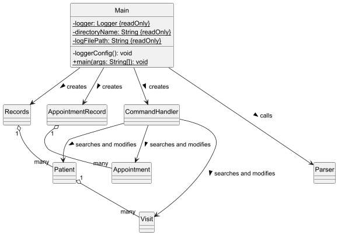
- At application launch, it initialises other components in the correct sequence and connects them up with each other. 
- At shut down, it shuts down the other components and invokes cleanup methods where necessary. 

 ---
The bulk of the BookBob's work is done by the following components: 
- `CommandHandler`: The command executor. 
  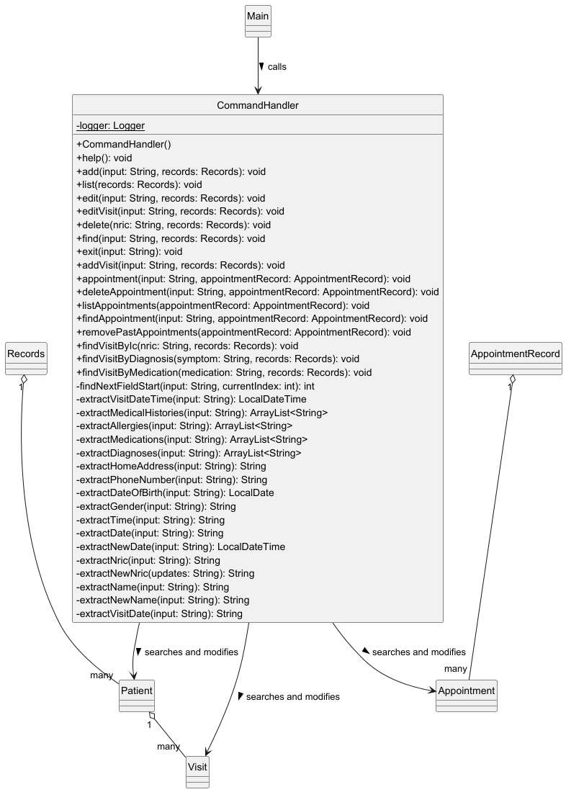

 ---
- `FileHandler`: Reads data from, and writes data to, the hard disk. 
  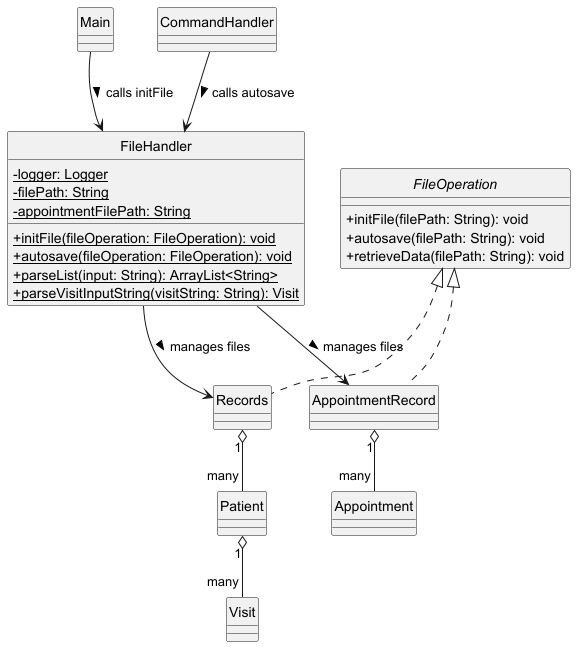

 ---
The entities storing data are the following components:  
- `Records`: The list of patients.  
  

 ---
- `AppointmentRecord`: The list of appointments.  
  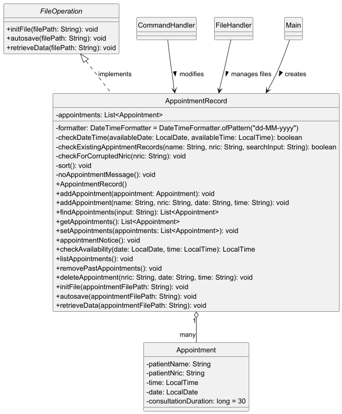

 ---
- `Appointment` : Information of appointment.  
  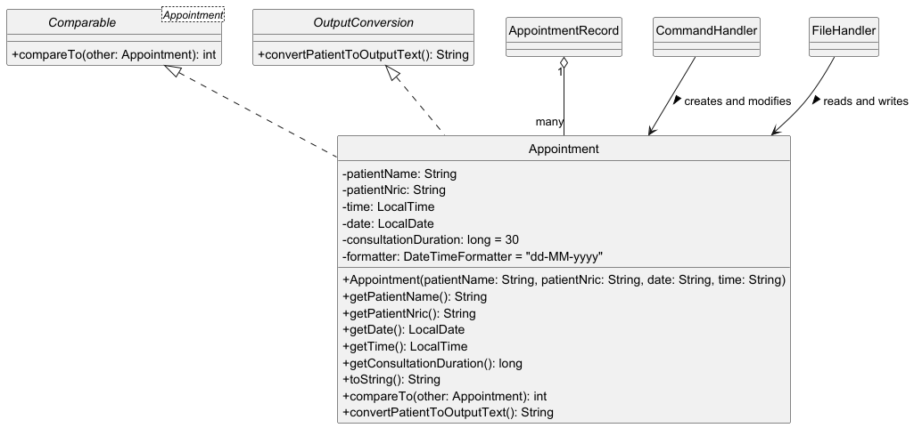

 ---
- `Visit`: The visit of patients.  
  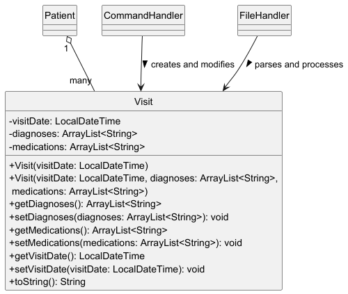

 ---
- `Patient`: Personal information of patient.  
  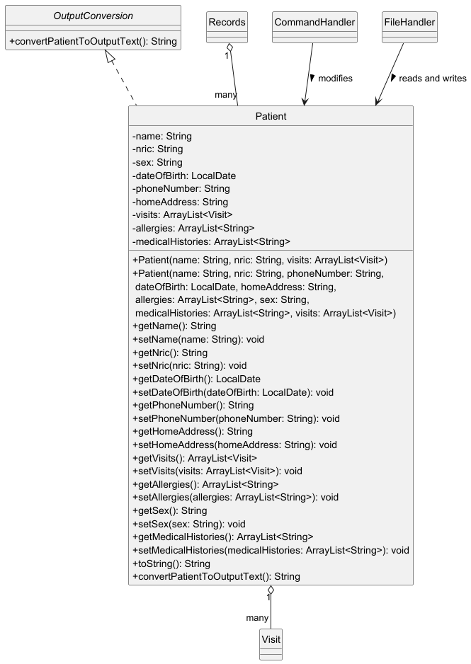

 ---
### 1. Managing Patient Visits and Records
### a. Adding New Visits for Existing Patients
The addVisit mechanism is handled by `CommandHandler`. It begins by scanning the patient records (`Records`) to locate 
the patient with the specified NRIC. Once the target patient is found, a new `Visit` object is created using the 
provided visit details. This new visit is then added to the patient's `ArrayList<Visit>`. Finally, the updated patient 
records are saved using `FileHandler` to ensure they can be retrieved later.

**Doctor enters the command:** `addVisit ic/S9870789B v/29-10-2024 10:00 d/Gastric m/Gaviscon, Paracetamol`

> The Object Diagram before the execution of addVisit command:
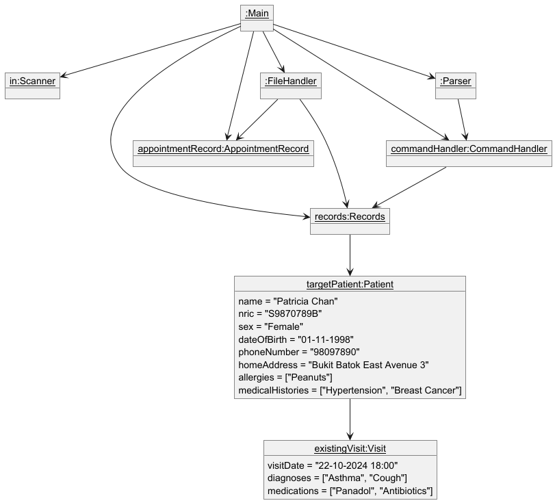

 > The Object Diagram after the execution of addVisit command:
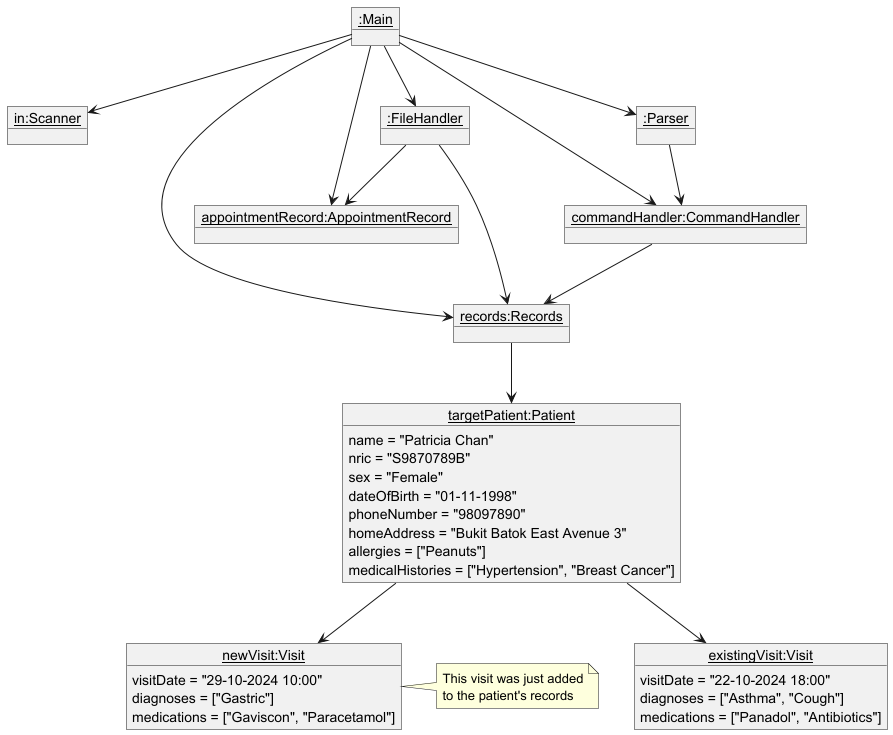

> The Sequence Diagram for the execution of addVisit command:
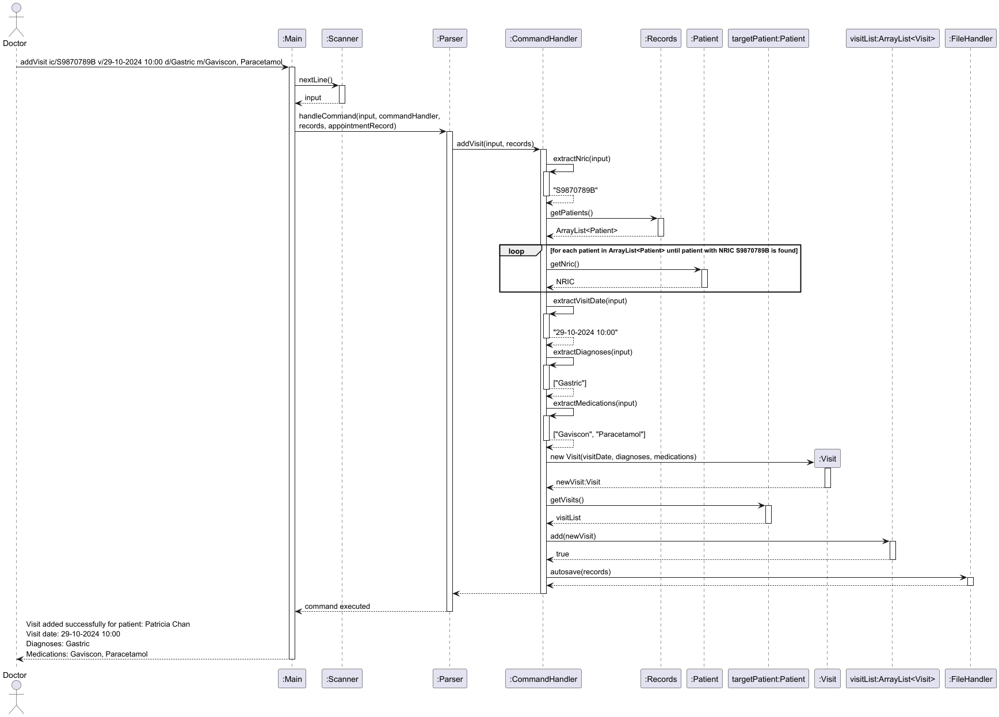

 ---
### b. Adding New Patient to the Patient Records
The "add" command mechanism for New Patients(first visit to clinic) is handled by `CommandHandler`. It begins by creating a new `Patient` object to store all related
information from terminal input. A new `Visit` object is compulsory to be created with the `Patient` object. This new 
visit is then added to the patient's `ArrayList<Visit>`. Finally, the new patient will be stored into the patient 
records (`Records`) which will be saved using `FileHandler` to ensure they can be retrieved later.

**Doctor enters the command:** `add n/Patricia Chan ic/S9870789B p/98097890 d/Cough m/Antibiotics ha/Bukit Batok East Avenue 3 
dob/01111998 v/21-10-2024 18:00 al/Peanuts s/Female mh/Hypertension`

> The Object Diagram before the execution of "add" command:
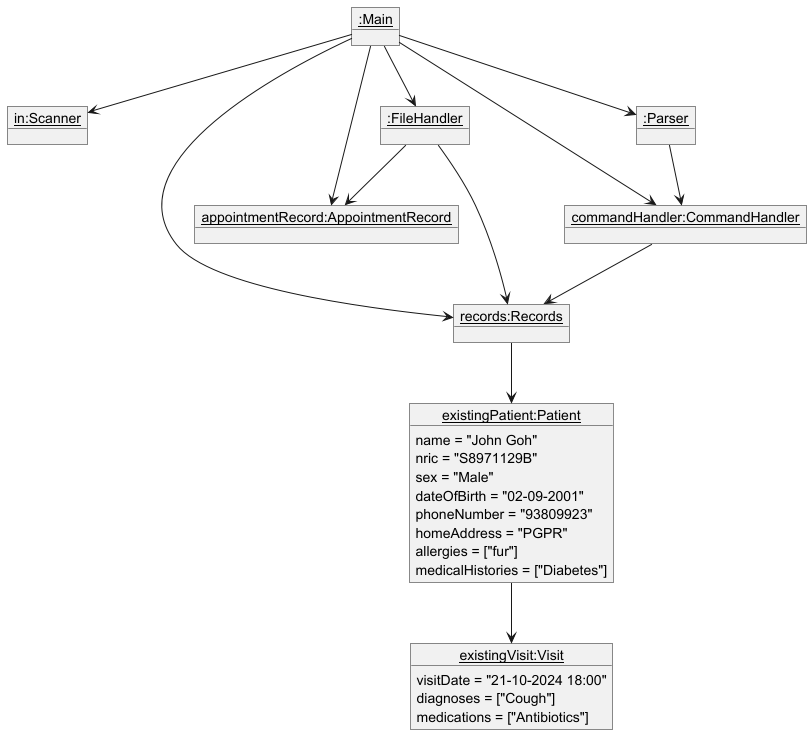

> The Object Diagram after the execution of "add" command:
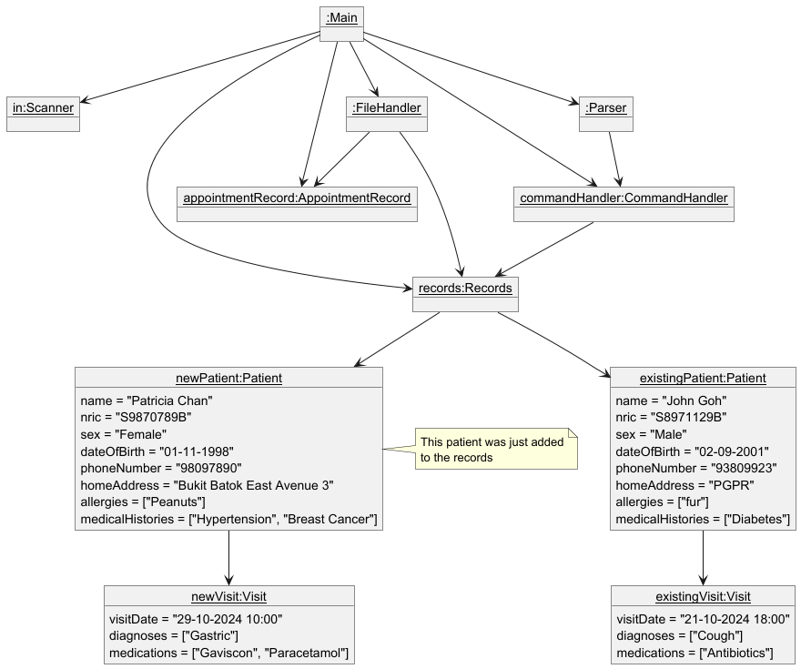

> The Sequence Diagram(s) for the execution of "add" command:

• There are two parts to the sequence diagrams; Part(1) shows the process for System Initialization and Input Processing, and Part(2)
shows the Patient Creation and Data Storage processes. 

<u>Part(1) System Initialization and Input Processing</u> :
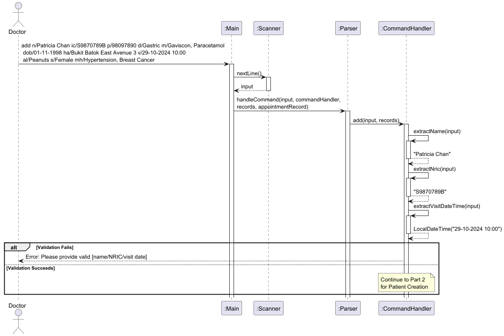
• This sequence diagram illustrates the initial phase of adding a new patient to the BookBob.
When the Doctor inputs the "add" command with patient details, the system workflow begins :
1. Main receives doctor's "add" command and routes it through Parser to CommandHandler.
2. CommandHandler performs validation checks and extracts mandatory fields (name, NRIC, visit date)
3. System either returns an error message if validation fails, or proceeds to patient creation.

<u>Part (2) Patient Creation and Data Storage</u> :
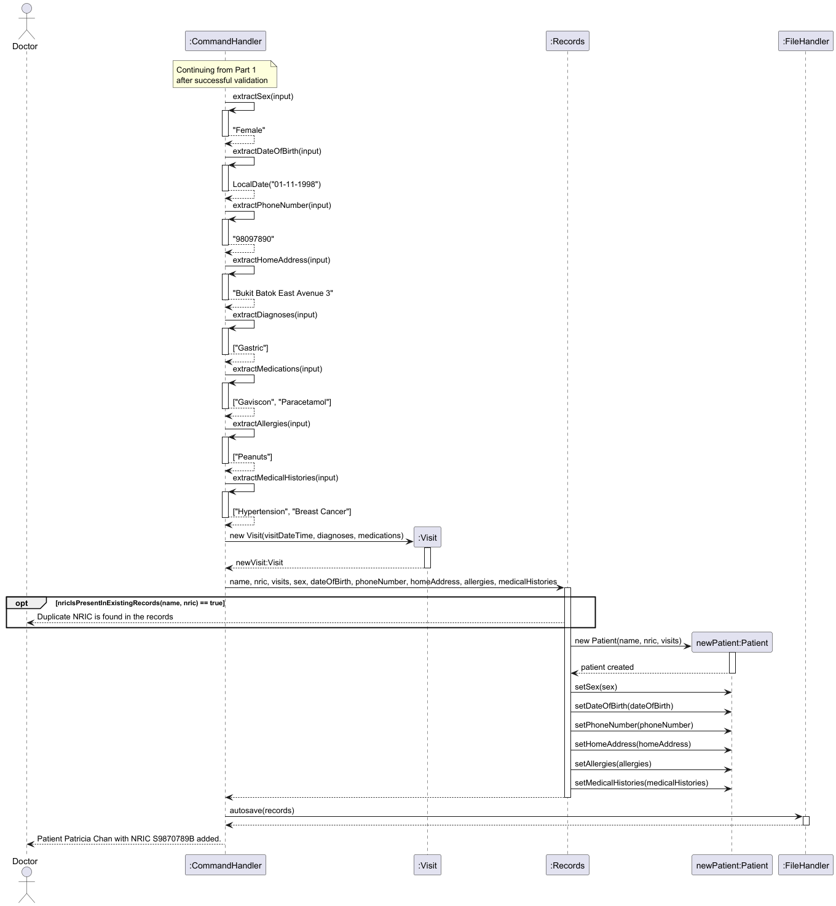
This sequence diagram shows the process of creating and storing a new patient's record after successful validation. The system workflow :
1. Extracts all remaining patient information (phone number, home address, DOB, allergies, medical histories).
2. Constructing a new Visit object with the provided data.
3. Creating a new Patient object (with core information i.e. name, NRIC).
4. Setting additional patient attributes (phone number, home address, DOB, allergies, medical histories). 
5. Adds patient to Records and auto-saves the data.

 ---
### c. Appointment Feature

The appointment mechanism is facilitated by `CommandHandler`. It creates an appointment slot via the `Appointment` 
class and records it within the `AppointmentRecord` class. The appointment records will then be saved into 
`FileHandler`.

- `CommandHandler.appointment(String input, AppointmentRecord appointmentRecord)` - check the input to check if valid
- `FileHandler.initFile(AppointmentRecord appointmentRecord)` - loads any saved appointment records
- `appointmentRecord.checkAvailability(LocalDate date, LocalTime time)` - check for availability at given time and date
- `AppointmentRecord.addAppointment(Appointment appointment)` - add appointment to the appointment record
- `Appointment(String name, String nric, String date, String time)` - creates appointment with the given name, nric,
- date and time
- `FileHandler.autosave(AppointmentRecord appointmentRecord)` - save the appointment records

**Doctor enters the command:** `appointment n/Patricia Chan ic/S9870789B date/06-11-2024 time/14:30`

> The Object Diagram before the execution of appointment command:\
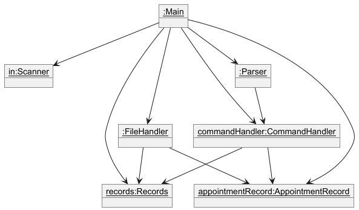

> The Object Diagram after the execution of appointment command:\
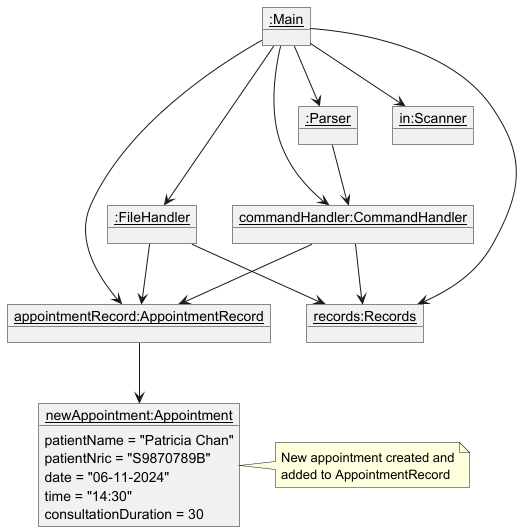

> The Sequence Diagram for the execution of appointment command:
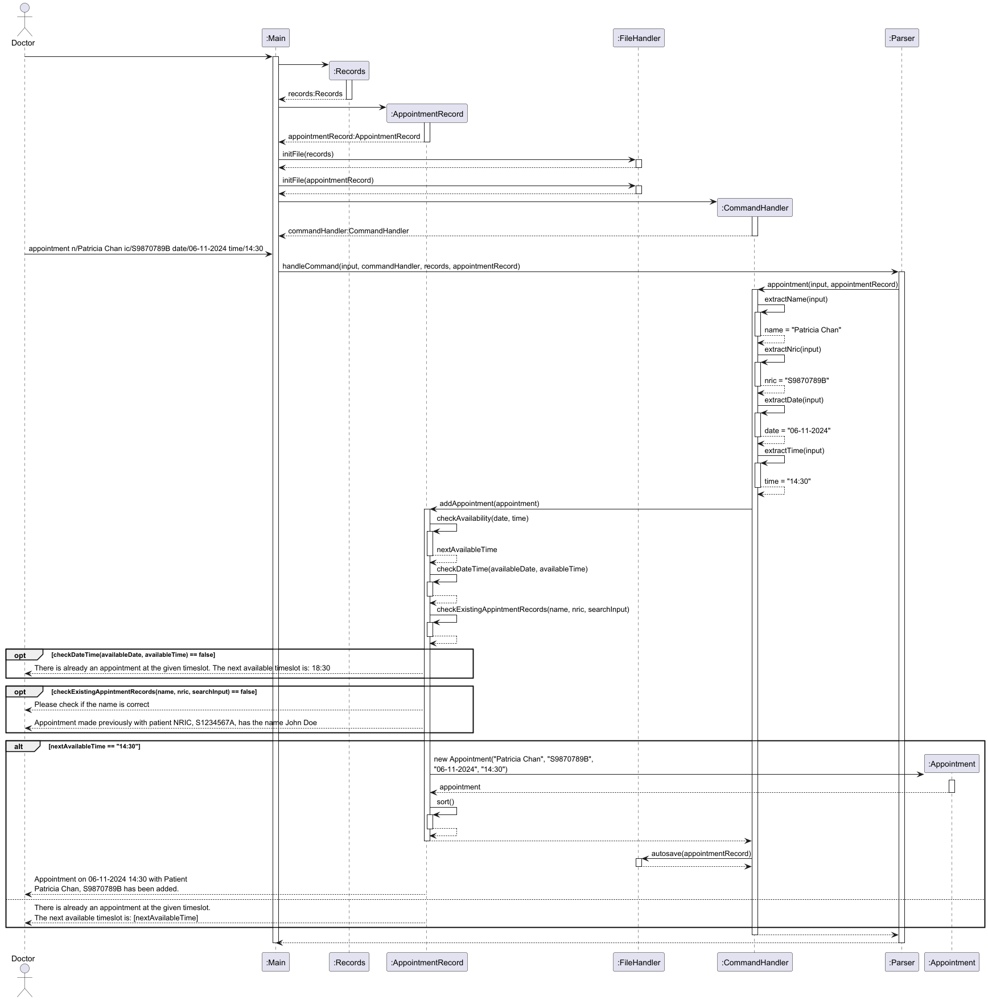

---
## Appendix A: Product Scope
### Target User Profile
Dr Bob is a General Practitioner running his own private clinic. He manages everything independently, attending to
significant number of patients with diverse health concerns each day. The demanding workload and long hours often leave him exhausted
and sleep-deprived. On his work desk, he relies on a personal desktop computer for his work. Dr Bob is a fast typer, prefers typing to mouse interactions, and is reasonably comfortable using CLI apps.

### Value Proposition
BookBob assists Dr Bob in storing and retrieving his patients' information, including their name, NRIC, sex, date of
birth, phone number, home address, allergies, medical history and visit records with details like diagnoses and
prescribed medications. Additionally, BookBob helps Dr Bob stay organised by tracking his daily appointments and
providing reminders of upcoming appointments at the start of each day. BookBob is a CLI-Optimised program, allowing quicker and easier managing of patients records compared to a typical mouse/GUI driven app.

---
## Appendix B: User Stories

| Version | As a...  | I want to...                                                          | So that I can...                                                    |
|---------|----------|-----------------------------------------------------------------------|---------------------------------------------------------------------|
| v1.0    | new user | see usage instructions for BookBob                                    | quickly understand how to use the app                               |
| v1.0    | new user | input a complex patient case                                          | test BookBob's capabilities thoroughly                              |
| v1.0    | user     | quickly search for a patient record                                   | retrieve information efficiently during consultations               |
| v1.0    | user     | delete case patient information                                       | retain patient information which I am still actively taking care of |
| v1.0    | user     | set up automatic backups of my patient data                           | never lose important information due to technical issues            |
| v2.0    | user     | view my daily appointments at a glance                                | prepare for my day efficiently                                      |
| v2.0    | user     | easily refer to and update a patient's care plan over multiple visits | ensure consistent, long-term care                                   |                                       

---
## Appendix C: Non-Functional Requirements
1. Should work on any mainstream OS (Windows, Linux, Unix, MacOS) as long as it has Java 17 or above installed.
2. Should be capable of supporting long-term use by a single doctor without requiring cache clearance.
3. A user with above average typing speed for regular English text (i.e. not code, not system admin commands) 
should be able to accomplish most of the tasks faster using commands than using the mouse.
4. Should be able to respond to any commands within 1 second under normal load.
5. Automated saving of data should happen after every modification of data.

---
## Appendix D: Glossary
- Mainstream OS: Windows, Linux, Unix, MacOS
- NRIC: National Registration Identity Card (Identification Number)

---
## Appendix E: Instructions for Manual Testing
Given below are instructions to test the app manually.

⚠️ <b>Note :</b> These instructions only provide a starting point for testers to work on; testers are expected to do more <i>exploratory</i> testing.

### Launch and Shutdown

### Initial Launch
1. Ensure and Verify that you have Java 17 installed in your computer by running `java --version` on the Command Prompt.
2. Download the <u>latest</u> BookBob.jar file from [here](https://github.com/AY2425S1-CS2113-T10-2/tp/releases).
3. Copy the file to your desired home folder for BookBob where you would like to run it from.
4. Using a command line tool, navigate to the path of BookBob.jar:
- If your operating system is Windows, use Command Prompt
- If your operating system is MacOS, use Terminal
- Enter `cd path/to/file`
5. Enter `java -jar BookBob.jar` in your command line tool and press enter.
6. If the setup is correct, you should see the welcome message.
7. Now BookBob is ready for your use:
- Create your patient record and date of visit by entering command `add` and `addVisit` respectively. Name, NRIC and VisitDate are compulsory fields, other fields are optional.
- Please reference from the above Command Summary Reference.
- Try to see your list of records by entering command `list`
8. Initial launch
    1. Test case: Launch the application for the first time  
       Expected: Welcome message "Welcome to BookBob, Dr. Bob!" is displayed. A new `data` directory and data files are created if they do not yet exist.

### Shutdown
1. Enter `exit` to exit BookBob. 
2. BookBob automatically saves your patient record data to a file named "bookbob_data.txt" in a "data" folder in the same directory as the BookBob.jar file.

3. Exit application 
   Test Case: `exit`  
   Expected: Application terminates, all data are saved.

---
## Patient Record Management

1. Adding a patient
    1. (Positive) Test Case (all fields): `add n/Mary Jane ic/S9876543A p/91234567 d/Fever m/Paracetamol ha/NUS PGPR dob/01011990 v/21-10-2024 15:48 al/Peanuts s/Female mh/Asthma`  
       Expected: Patient Mary Jane is added with all provided information.

    2. (Negative) Test Case (missing mandatory fields): `add n/Mary Jane p/91234567`  
       Expected: Error message requesting NRIC and visit date.

    3. (Negative) Test Case (invalid date format): `add n/Mary Jane ic/S9876543A v/2024-10-21`  
       Expected output: Error message about invalid date format. 
 
2. Listing patients
    1. (Positive) Test Case: `list`  
       Expected: Displays all patient records with their details and visit history.

    2. (Negative) Test Case (empty records): `list` when no patients exist  
       Expected: "No patients found." message. 
 
3. Finding patients
    1. (Positive) Test Case (by NRIC): `find ic/S1234567Z`  
       Expected: Lists all patients whose NRIC contains "S1234567Z".

    2. (Positive) Test Case (by name): `find n/John`  
       Expected: Lists all patients whose names contain "John".

    3. (Negative) Test Case (invalid search key): `find x/John`  
       Expected: Error message about invalid search key. 
 
4. Editing patient records
    1. (Positive) Test Case: `edit ic/S9876543A /to n/John Smith p/92345678`  
       Expected: Patient's name updated to "John Smith" and phone number to "92345678".

    2. (Negative) Test Case (non-existent patient): `edit ic/S0000000X /to n/John Smith`  
       Expected: "No patient found." message. 
 
5. Deleting patient records
    1. (Positive) Test Case: `delete S9876543A`  
       Expected: Patient record is deleted and confirmation message shown.

    2. (Negative) Test Case (non-existent NRIC): `delete S0000000X`  
       Expected: Error message that patient not found.
---
### Visit Management

1. Adding visits
    1. (Positive) Test Case: `addVisit ic/S9876543A v/21-10-2024 15:48 d/Fever,Cough m/Paracetamol,Cough Syrup`  
       Expected: Visit added to patient's record with diagnoses and medications.

    2. (Negative) Test Case (missing visit date): `addVisit ic/S9876543A d/Fever`  
       Expected: Error message requesting visit date. 
 
2. Finding visits
    1. (Positive) Test Case (by NRIC): `findVisit S9876543A`  
       Expected: Displays all visits for the specified patient.

    2. (Positive) Test Case (by diagnosis): `findDiagnosis Fever`  
       Expected: Lists all patients who were diagnosed with fever.

    3. (Positive) Test Case (by medication): `findMedication Paracetamol`  
       Expected: Lists all patients who were prescribed paracetamol.
---
### Appointment Management

1. Adding appointments
    1. (Positive) Test Case: `appointment n/John Doe ic/S9876543A date/01-04-2025 time/12:00`  
       Expected: Appointment is added if timeslot is available.

    2. (Negative) Test Case (clash): Add appointment at same date/time as existing appointment
       Expected: Error message suggesting next available timeslot. 
 
2. Listing appointments
    1. (Positive) Test Case: `listAppointments`  
       Expected: Shows all future appointments chronologically. 
 

3. Finding appointments
    1. (Positive) Test Case: `findAppointment ic/S9876543A`  
       Expected: Shows all appointments for the specified patient. 
 

4. Deleting appointments
    1. (Positive) Test Case: `deleteAppointment ic/S9876543A date/01-04-2025 time/12:00`  
       Expected: Specified appointment is deleted.

    2. (Negative) Test Case (non-existent appointment): Delete appointment that doesn't exist  
       Expected: Error message that appointment doesn't exist.
---
### Data Persistence (Saving and Loading)

1. Automatic Storage
    1. Test case: Add/edit/delete records, then restart application
        - Expected: All changes are preserved after restart
        - Note: Data is automatically saved to `bookbob_data.txt` in the `data` folder (same directory as BookBob.jar) 
 

2. File Management
    1. Test case: Manually View saved data
        - Action: Navigate to `data` folder (same directory as BookBob.jar) and open `bookbob_data.txt`
        - Note: Do not manually modify the file contents to prevent data corruption. Saving and loading data is automated as long as file is not corrupted.

    2. Test case: Delete data file and restart application
        - Action: Delete `bookbob_data.txt` from the `data` folder
        - Expected: New `bookbob_data.txt` file is automatically generated. The missing text file will not result in any error as files will be generated automatically.
        - Note: This can be used to start with a fresh database if needed  
 

3. Error Handling
    1. Test case: Corrupt the data file manually, then start application
        - Expected: Error message is shown about invalid data
        - Note: BookBob will continue to function
        - Recovery options:
            * Option 1: Manually remove corrupted lines from `bookbob_data.txt`
            * Option 2: Delete `bookbob_data.txt` to start afresh 
---
### Command Summary Reference

| Action              | Format                                                                                                                                                                                                | Example                                                                                                                                                                  |
|---------------------|-------------------------------------------------------------------------------------------------------------------------------------------------------------------------------------------------------|--------------------------------------------------------------------------------------------------------------------------------------------------------------------------|
| Help                | `help`                                                                                                                                                                                                | `help`                                                                                                                                                                   |
| Add patient record  | `add n/NAME ic/NRIC [p/PHONE_NUMBER] [d/DIAGNOSIS] [m/MEDICATION] [ha/HOME_ADDRESS] [dob/DATE_OF_BIRTH] v/VISIT_DATE_TIME [al/ALLERGY] [s/SEX] [mh/MEDICALHISTORY]`                                   | `add n/James Ho ic/S9534567A p/91234567 d/Asthma m/Albuterol ha/NUS-PGPR dob/01-01-1990 v/21-10-2024 15:48 al/Pollen s/Female mh/Diabetes`                               |
| Edit patient record | `edit ic/NRIC /to [n/NAME] [newic/NEW_NRIC] [p/PHONE_NUMBER] [ha/HOME_ADDRESS] [dob/DATE_OF_BIRTH] [al/ALLERGY] [s/SEX] [mh/MEDICAL_HISTORY]`                                                         | `edit ic/S9534567A /to p/80976890 mh/Diabetes, Hypertension `                                                                                                            |
| Add Visit           | `addVisit ic/NRIC v/VISIT_DATE_TIME [d/DIAGNOSIS] [m/MEDICATION]` DATE format: `dd-MM-yyyy` TIME format: `HH:mm`                                                                                | `addVisit ic/S9534567A v/21-10-2024 15:48 d/Fever,Headache,Flu m/Paracetamol,Ibuprofen`                                                                                  |
| Edit Visit          | `editVisit ic/NRIC v/VISIT_DATE_TIME [newDate/NEW_DATE] [d/DIAGNOSIS] [m/MEDICATION]` DATE format: `dd-MM-yyyy` TIME format: `HH:mm`                                                            | `editVisit ic/S7209876Y v/06-11-2024 14:00 d/Asthma m/Panadol, Antibiotics`                                                                                              |
| List                | `list`                                                                                                                                                                                                | `list`                                                                                                                                                                   |
| Find                | `find n/NAME` OR `find ic/NRIC` OR `find p/PHONE_NUMBER` OR `find ha/HOME_ADDRESS` OR `find dob/DATE_OF_BIRTH` OR `find al/ALLERGY` OR `find s/SEX` OR `find mh/MEDICAL_HISTORY` | `find n/John Doe` `find ic/S9234567A` `find p/91234567` `find ha/NUS PGPR` `find dob/01011990` `find al/Peanuts` `find s/Female` `find mh/Diabetes` |
| Delete              | `delete NRIC`                                                                                                                                                                                         | `delete S9534567A`                                                                                                                                                       |
| Add Appointment     | `appointment n/NAME ic/NRIC date/DATE time/TIME` DATE format: `dd-MM-yyyy` TIME format: `HH:mm`                                                                                                 | `appointment n/James Ho ic/S9534567A date/01-04-2025 time/12:00`                                                                                                         |
| List Appointment    | `listAppointments`                                                                                                                                                                                    | `listAppointments`                                                                                                                                                       |
| Find Appointment    | `findAppointment n/NAME` OR `findAppointment ic/NRIC` OR `findAppointment date/DATE` OR `findAppointment time/TIME` DATE format: `dd-MM-yyyy` TIME format: `HH:mm`                     | `findAppointment n/John Doe` `findAppointment ic/S9234567A` `findAppointment date/01-04-2025` `findAppointment time/12:00`                                      |
| Delete Appointment  | `deleteAppointment NRIC date/DATE time/TIME` DATE format: `dd-MM-yyyy` TIME format: `HH:mm`                                                                                                     | `deleteAppointment S9534567A date/01-04-2025 time/12:00`                                                                                                                 |
| Find Visits         | `findVisit NRIC`                                                                                                                                                                                      | `findVisit S9534567A`                                                                                                                                                    |
| Find Diagnosis      | `findDiagnosis diagnosis`                                                                                                                                                                             | `findDiagnosis fever`                                                                                                                                                    |
| Find Medication     | `findMedication medication`                                                                                                                                                                           | `findMedication Panadol`                                                                                                                                                 | 
| Exit                | `exit`                                                                                                                                                                                                | `exit`                                                                                                                                                                   |
